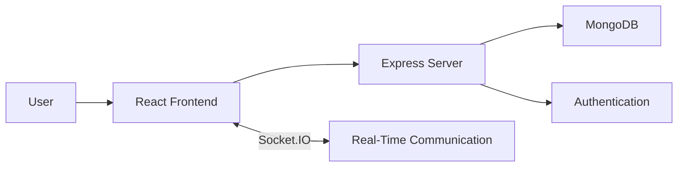
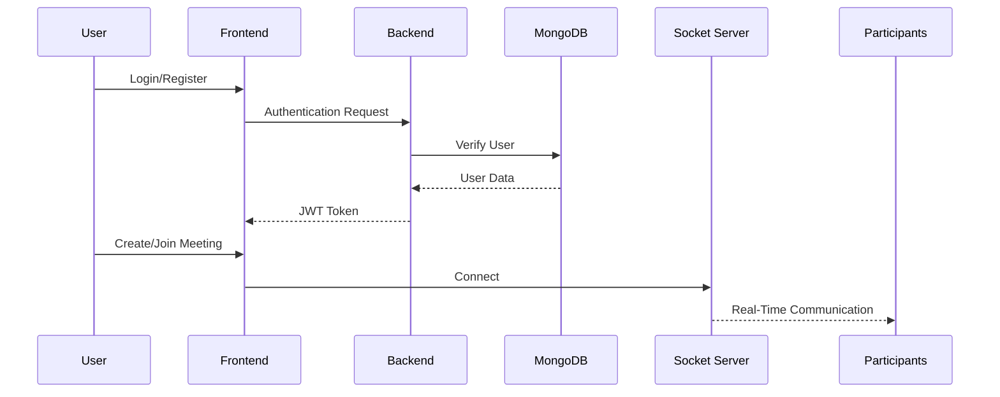
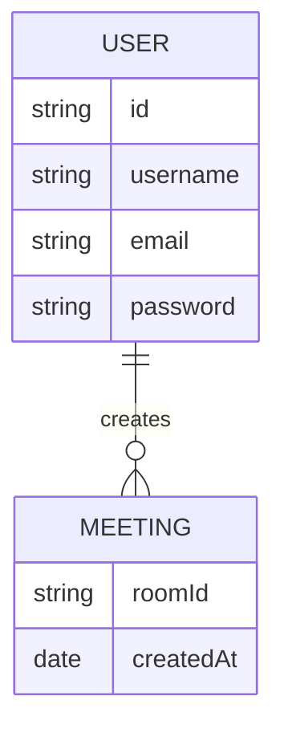

<div align="center">

# 🎥 AirMeet

### A Full-Stack Video Conferencing Platform built using the MERN Stack

Real-time video meetings • Secure Authentication • Meeting History • Socket.IO Powered


</div>

---

# 🚀 About

AirMeet is a MERN Stack based video conferencing application that enables users to securely create and join virtual meeting rooms.

The platform supports user authentication, protected routes, real-time communication using Socket.IO, and meeting history management. It provides an intuitive interface for hosting and participating in online meetings.

---

# ✨ Features

- Secure User Authentication
- Create Video Meeting Rooms
- Join Existing Meetings
- Real-Time Communication
- Meeting History
- Protected Routes
- Responsive UI
- REST APIs
- MongoDB Integration

---

# 🛠 Tech Stack

| Frontend | Backend | Database | Realtime |
|-----------|----------|-----------|-----------|
| React.js | Node.js | MongoDB | Socket.IO |
| React Router | Express.js | Mongoose | WebSockets |
| Material UI | JWT Authentication | | |

---

# 🏗 Architecture



---

# 🔄 Application Flow



---

# 📂 Project Structure

```text
Airmeet
│
├── frontend
│   ├── public
│   ├── src
│   │   ├── api
│   │   ├── contexts
│   │   ├── pages
│   │   ├── utils
│   │   └── App.js
│   └── package.json
│
├── backend
│   ├── src
│   │   ├── controllers
│   │   ├── models
│   │   ├── routes
│   │   └── app.js
│   └── package.json
│
└── README.md
```

---

# ⚙️ Installation

Clone the repository

```bash
git clone https://github.com/udhruvi007/Airmeet.git
```

Move inside the project

```bash
cd Airmeet
```

### Install Frontend

```bash
cd frontend
npm install
```

### Install Backend

```bash
cd backend
npm install
```

---

# 🔑 Environment Variables

Create a `.env` file inside the backend folder.

```env
PORT=8000
MONGO_URI=Your MongoDB URI
FRONTEND_URL=http://localhost:3000
JWT_SECRET=your_secret_key
```

---

# ▶️ Running the Project

### Backend

```bash
cd backend
npm run dev
```

### Frontend

```bash
cd frontend
npm start
```

---

# 📊 Database Flow


